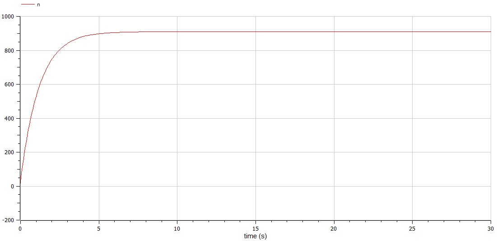
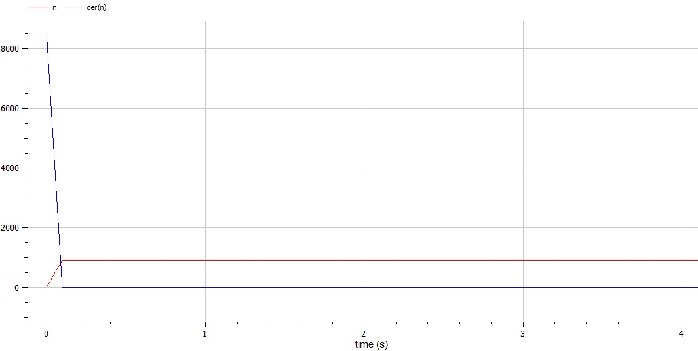
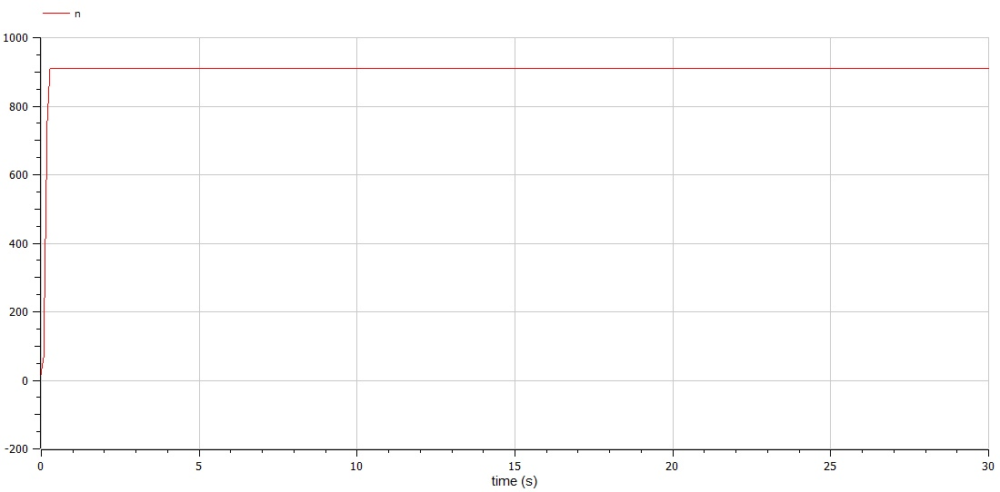

---
# Front matter
lang: ru-RU
title: Защита лабораторной работы №7. Эффективность рекламы
author: "Бурдина Ксения Павловна"
group: NFIbd-01-19
institute: RUDN University, Moscow, Russian Federation
date: 2022 Mar 22th

# Formatting
toc: false
slide_level: 2
header-includes: 
 - \metroset{progressbar=frametitle,sectionpage=progressbar,numbering=fraction}
 - '\makeatletter'
 - '\beamer@ignorenonframefalse'
 - '\makeatother'
aspectratio: 43
section-titles: true
theme: metropolis

---

# Результат выполнения лабораторной работы №7

# Цель выполнения лабораторной работы 

## Цель выполнения лабораторной работы

Необходимо научиться выполнять построение математической модели эффективности рекламы. Нужно рассмотреть задачу о распространении рекламы и изменении числа оповещенных жителей некоторого района с течением времени.

# Задачи выполнения лабораторной работы

## Задачи выполнения лабораторной работы

- Провести рассуждения и записать дифференциальные уравнения распространения рекламы при заданных начальных условиях;

- Построить график изменения числа особей для трёх случаев с учетом распространения рекламы с помощью СМИ и с помощью "сарафанного радио";

- Для случая 2 определить, в какой момент времени скорость распространения рекламы $\frac{dn}{dt}$ будет иметь максимальное значение.

# Уравнения

## Уравнения

Начальные условия:
$$\left\{ 
\begin{array}{c}
N = 910 \\
n_0 = 16 \\
\end{array}
\right.$$

Основное уравнение:
$$\frac{dn}{dt} = (\alpha _1(t)+\alpha _2(t)n(t))(N-n(t))$$

## Уравнения

Модель изменения числа потенциальных потребителей:

- для случая 1:
$$\frac{dn}{dt} = (0.84+0.00002n(t))(N-n(t))$$

- для случая 2:
$$\frac{dn}{dt} = (0.000084+0.6n(t))(N-n(t))$$

- для случая 3:
$$\frac{dn}{dt} = (0.3sin(3t)+0.3*t*n(t))(N-n(t))$$

# Результат выполнения лабораторной работы

## Результат выполнения лабораторной работы

Модель изменения числа потенциальных потребителей в случае 1:

{width=80%}

## Результат выполнения лабораторной работы

Модель изменения числа потенциальных потребителей в случае 2:

{width=80%}

## Результат выполнения лабораторной работы

Модель изменения числа потенциальных потребителей в случае 3:

{width=80%}

# Вывод

## Вывод

- Провели рассуждения и выполнили построение математической модели эффективности распространения рекламы для решения задачи;

- Получили дифференциальные уравнения, на основе которых решили задачу об изменении числа оповещенных жителей со временем;

- Построили графики изменения числа потенциальных потребителей для трёх случаев с учётом возможности распространения рекламы с помощью СМИ и с помощью "сарафанного радио".

