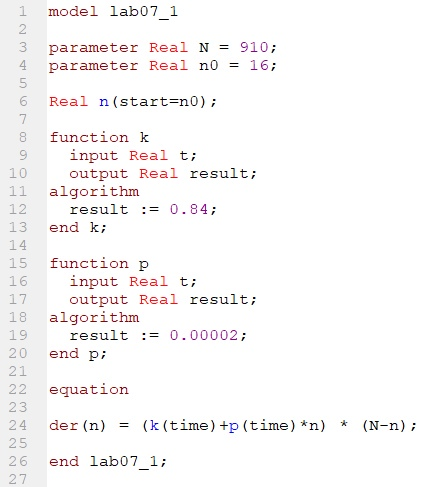
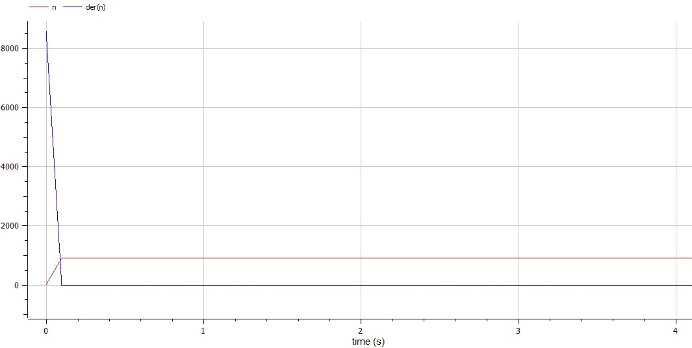

---
# Front matter
title: "Отчет по лабораторной работе №7"
subtitle: "Модель эффективности рекламы"
author: "Бурдина Ксения Павловна"
group: NFIbd-01-19
institute: RUDN University, Moscow, Russian Federation
date: 2022 Mar 22th

# Generic otions
lang: ru-RU
toc-title: "Содержание"

# Bibliography
csl: pandoc/csl/gost-r-7-0-5-2008-numeric.csl

# Pdf output format
toc: true # Table of contents
toc_depth: 2
lof: true # List of figures
fontsize: 12pt
linestretch: 1.5
papersize: a4
documentclass: scrreprt
### Fonts
mainfont: PT Serif
romanfont: PT Serif
sansfont: PT Sans
monofont: PT Mono
mainfontoptions: Ligatures=TeX
romanfontoptions: Ligatures=TeX
sansfontoptions: Ligatures=TeX,Scale=MatchLowercase
monofontoptions: Scale=MatchLowercase,Scale=0.9
## Biblatex
biblatex: true
biblio-style: "gost-numeric"
biblatexoptions:
  - parentracker=true
  - backend=biber
  - hyperref=auto
  - language=auto
  - autolang=other*
  - citestyle=gost-numeric
## Misc options
indent: true
header-includes:
  - \linepenalty=10 # the penalty added to the badness of each line within a paragraph (no associated penalty node) Increasing the value makes tex try to have fewer lines in the paragraph.
  - \interlinepenalty=0 # value of the penalty (node) added after each line of a paragraph.
  - \hyphenpenalty=50 # the penalty for line breaking at an automatically inserted hyphen
  - \exhyphenpenalty=50 # the penalty for line breaking at an explicit hyphen
  - \binoppenalty=700 # the penalty for breaking a line at a binary operator
  - \relpenalty=500 # the penalty for breaking a line at a relation
  - \clubpenalty=150 # extra penalty for breaking after first line of a paragraph
  - \widowpenalty=150 # extra penalty for breaking before last line of a paragraph
  - \displaywidowpenalty=50 # extra penalty for breaking before last line before a display math
  - \brokenpenalty=100 # extra penalty for page breaking after a hyphenated line
  - \predisplaypenalty=10000 # penalty for breaking before a display
  - \postdisplaypenalty=0 # penalty for breaking after a display
  - \floatingpenalty = 20000 # penalty for splitting an insertion (can only be split footnote in standard LaTeX)
  - \raggedbottom # or \flushbottom
  - \usepackage{float} # keep figures where there are in the text
  - \floatplacement{figure}{H} # keep figures where there are in the text
---

# Цель работы

Целью данной работы является построение математической модели эффективности рекламы на примере задачи о распространении информации об открытии салона красоты среди жителей некоторого района.

# Задание

В ходе работы необходимо:

1. Прописать уравнения для построения модели распространения рекламы при условии, что общее число проживающих в районе $N = 910$, а в начальный момент времени о товаре знают $n_0 = 16$ человек.

2. Построить графики изменения числа потенциальных покупателей со временем для трех случаев с учетом распространения информации с помощью платной рекламы и с помощью "сарафанного радио".

3. Для случая 2 определить, в какой момент времени скорость распространения рекламы $\frac{dn}{dt}$ будет иметь максимальное значение.

# Теоретическое введение

Постановка задачи следующая:

В городе открылся новый салон красоты. Полагаем, что на момент открытия о салоне знали $n_0$ потенциальных клиентов. По маркетинговым исследованиям известно, что в районе проживают $N$ потенциальных клиентов салона. Поэтому после открытия салона руководитель запускает активную рекламную компанию. После этого скорость изменения числа знающих о салоне пропорциональна как числу знающих о нем, так и числу не знаю о нем.

Решение исходной задачи сводится к решению системы дифференциальных уравнений: 

$$\frac{dn}{dt} = (0.84+0.00002n(t))(N-n(t))$$
в случае 1;

$$\frac{dn}{dt} = (0.000084+0.6n(t))(N-n(t))$$
в случае 2;

$$\frac{dn}{dt} = (0.3sin(3t)+0.3*t*n(t))(N-n(t))$$
в случае 3, с начальными условиями:

$$\left\{ 
\begin{array}{c}
N = 910 \\
n_0 = 16 \\ 
\end{array}
\right.$$

# Выполнение лабораторной работы

1. Организуется рекламная кампания нового товара или услуги. Необходимо, чтобы прибыль будущих продаж с избытком покрывала издержки на рекламу. Сначала расходы могут превышать прибыль, поскольку лишь малая часть потенциальных покупателей будет информирована о новинке. Затем, при увеличении числа продаж, возрастает и прибыль, и, наконец, наступит момент, когда рынок насытиться, и рекламировать товар станет бесполезным.

2. Предположим, что торговыми учреждениями реализуется некоторая продукция, о которой в момент времени $t$ из числа потенциальных покупателей $N$ знает лишь $n_0$ покупателей. Для ускорения сбыта продукции запускается реклама по средствам массовой информации. После запуска рекламной кампании информация о продукции начнет распространяться среди потенциальных покупателей путем общения друг с другом.

3. Модель рекламной кампании описывается следующими величинами. Считаем, что $\frac{dn}{dt}$ - скорость изменения со временем числа потребителей, узнавших о товаре и готовых его купить, $t$ - время, прошедшее с начала рекламной кампании, $n(t)$ - число проинформированных клиентов. Эта величина пропорциональна числу покупателей, еще не знающих о нем, это описывается следующим образом: $\alpha _1(t)(N-n(t))$, где $N$ - общее число потенциальных платежеспособных покупателей, $\alpha _1(t)>0$ - характеризует интенсивность рекламной кампании.

4. В качестве распространения информации также может работать "сарафанное радио", то есть узнавшие о товаре потребители распространяют полученную информацию среди потенциальных покупателей, не знающих о нем. Этот вклад в рекламу описывается величиной $\alpha _2(t)n(t)(N-n(t))$, эта величина увеличивается с увеличением числа потребителей, узнавших о товаре.

5. Определим уравнение, описывающее скорость изменения числа потенциалных потребителей [[1]](https://esystem.rudn.ru/pluginfile.php/1343901/mod_resource/content/2/%D0%9B%D0%B0%D0%B1%D0%BE%D1%80%D0%B0%D1%82%D0%BE%D1%80%D0%BD%D0%B0%D1%8F%20%D1%80%D0%B0%D0%B1%D0%BE%D1%82%D0%B0%20%E2%84%96%206.pdf). Оно имеет следующий вид:

$$\frac{dn}{dt} = (\alpha _1(t)+\alpha _2(t)n(t))(N-n(t))$$

При построении модели в случае, когда $\alpha _1(t)\geqslant \alpha _2(t)$ получится модель типа модели Мальтуса. А при $\alpha _1(t)\leqslant \alpha _2(t)$ - уравнение логистической кривой. 

6. Для решения соответствующих уравнений необходимо задать начальные условия. Считаем, что на начало распространении рекламы в момент времени $t_0$ число потенциальных клиентов составляло $n_0=16$. 

Для построения моделей эффективности рекламы будем учитывать распространение с помощью платной рекламы и с помощью "сарафанного радио".

7. Напишем программу для расчёта изменения числа потенциальных клиентов в OpenModelica. Зададим начальное состояние системы:
$$N = 910$$
$$n0 = 16$$

Установим, что переменная $n$ имеет начальное значения $n0$. Запишем уравнение, описывающие нашу модель, для первого случая:
$$der(n) = (k(time)+p(time)*n) * (N-n)$$

Также необходимо задать функции $k$ и $p$, которые будут отвечать за коэффициенты распространения рекламы с помощью СМИ  и с помощью сарафанного радио. В первом случае они составляют $k(t)=0.84$ и $p(t)=0.00002$ соответственно.

{width=80%}

Установим, что промежуток времени, на котором мы рассматриваем изменение числа потенциальных клиентов: $t \in [0:30]$, а шаг составляет $0.1$

В результате выполнения данной программы получаем следующий график изменения числа потенциальных клиентов:

8. Напишем программу для расчёта изменения числа потенциальных клиентов для второго случая. Начальное состояние системы остается прежним:
$$N = 910$$
$$n0 = 16$$

Уравнение, описывающие нашу модель, для второго случая:
$$der(n) = (k(time)+p(time)*n) * (N-n)$$

Функции $k$ и $p$, которые отвечают за коэффициенты распространения рекламы с помощью СМИ  и с помощью сарафанного радио во втором случае составляют $k(t)=0.000084$ и $p(t)=0.6$ соответственно.

{width=80%}

В результате выполнения данной программы получаем следующий график изменения числа потенциальных клиентов:

По графику видно, что наивысшая скорость распространения рекламы приходится на начальный момент времени.

9. Напишем программу для расчёта изменения числа потенциальных клиентов для третьего случая. Начальное состояние системы остается прежним:
$$N = 910$$
$$n0 = 16$$

Уравнение, описывающие нашу модель, для третьего случая:
$$der(n) = (k(time)+p(time)*n) * (N-n)$$

Функции $k$ и $p$, которые отвечают за коэффициенты распространения рекламы с помощью СМИ  и с помощью сарафанного радио в третьем случае составляют $k(t)=0.3sin(3t)$ и $p(t)=0.3t$ соответственно.

{width=80%}

В результате выполнения данной программы получаем следующий график изменения числа потенциальных клиентов:

# Выводы

В процессе выполнения работы мы построили модель эффективности рекламы на примере задачи о распространении информации об открытии салона среди жителей района. Получили дифференциальные уравнения для построения модели изменения числа потенциальных клиентов с учетом начального состояния системы для трех случаев. Построили графики изменения числа оповещенных жителей, а также для случая 2 определили, в какой момент времени будет максимальная скорость распространения рекламы.

# Список литературы

1. Методические материалы курса "Математическое моделирование" [[1]](https://esystem.rudn.ru/pluginfile.php/1343901/mod_resource/content/2/%D0%9B%D0%B0%D0%B1%D0%BE%D1%80%D0%B0%D1%82%D0%BE%D1%80%D0%BD%D0%B0%D1%8F%20%D1%80%D0%B0%D0%B1%D0%BE%D1%82%D0%B0%20%E2%84%96%206.pdf).

2. Математическое моделирование рекламной кампании. Электронный справочник: [[2]](https://cyberleninka.ru/article/n/matematicheskoe-modelirovanie-reklamnoy-kampanii).
